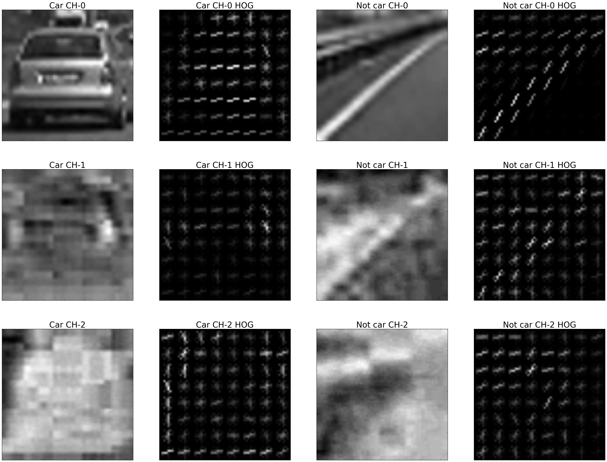
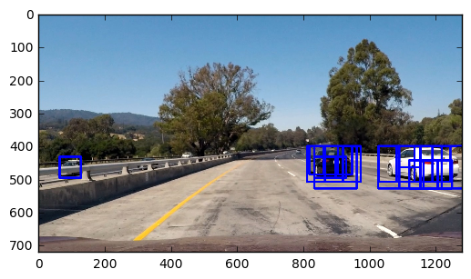
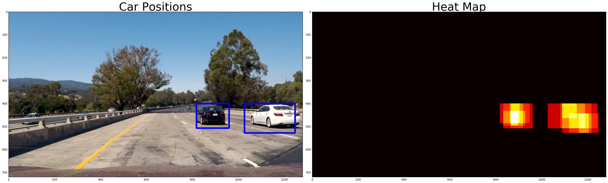

# Vehicle Detection

  

The goals / steps of this project are the following:

* Perform a Histogram of Oriented Gradients (HOG) feature extraction on a labeled training set of images and train a classifier Linear SVM classifier
* Optionally, you can also apply a color transform and append binned color features, as well as histograms of color, to your HOG feature vector. 
* Note: for those first two steps don't forget to normalize your features and randomize a selection for training and testing.
* Implement a sliding-window technique and use your trained classifier to search for vehicles in images.
* Run your pipeline on a video stream (start with the test_video.mp4 and later implement on full project_video.mp4) and create a heat map of recurring detections frame by frame to reject outliers and follow detected vehicles.
* Estimate a bounding box for vehicles detected.

Feature extraction
---

For the training, three features were used: binned image feature, color histogram feature and HOG feature. First, an RGB image was converted to YCrCB image. Then binned image and color histogram features extracted. 

Also, HOG feature extraction was performed using all channels of YCrCb image, by which good performance was obtained in the HOG feature extraction. The image below shows the result of HOG feature extraction.

  

Training Support Vector Machine (SVM)
---

Binned image feature, color histogram feature, and HOG feature were extracted from the single image and combined into one matrix as a input feature for SVM. With `vehicle` and `non-vehicle` data set, training was performed using `LinearSVC` class from SKLearn. The numbers of the images of the training set were 8792 and 8968, respectively. Two data sets were merged into one, and 20% of the total data set was split for test set. Trained classifier showed 0.9882 of accuracy.

Sliding window search
---

Search windows were built by applying a few conditions. First, search range was restricted to avoid search vehicles out of the road. Second, overlap ratio of the window was `0.5` for both X and Y directions. Third, 4 window sizes were used: `(64, 64)`, `(86, 86)`, `(108, 108)` and `(128, 128)`. Cropped images from each window were resized to `(64, 64)`, which is the size of training data image, and SVM classifier predicted whether the image is a car or not. The image below is an example of the sliding window search.

  

After the search, a heat map was generated to combine overlapped search result into a single box. Windows were marked on the heat map and threshold value was applied to reduce false positive. Here is an example of the heat map.

  

Considering the video, in which the flow of images is always continuous, another skill can be applied to reduce false positive. Found windows from the previous frame were added as a source to search cars in the current frame, which can enable higher heat map threshold to be used.

Result video
---

Here are the result videos using the vehicle detection pipeline. In the second video, false positive reduction using the windows of previous frame was applied.

* [Project video 1](https://youtu.be/dYgyZRtGRCU)

* [Project video 2 (False positive reduction)](https://youtu.be/NbLypwze8Xo)

Discussion
---

Comparing two videos, the second video in which false positive reduction was applied showed more stable result. This is because previous frame's windows could be reliable source and enabled higher heat map threshold which led reuction of false positive detection. However, I can see false positive in the video yet though it rarely appears. Also, my pipeline was struggled when the size of the car is very small or large. I tried to minimize the variation of window size to reduce calculation time, and it might be the reason. The more variety of window size and higher heat map threshold can make better result, but it also increases the calculation time significantly. Alternatively, I think applying deep neural network can be good solution. Deep neural network classifier might give better result than SVM, and it is more easy to utilize GPU power with DNN classifier which can increase the speed of calculation.

